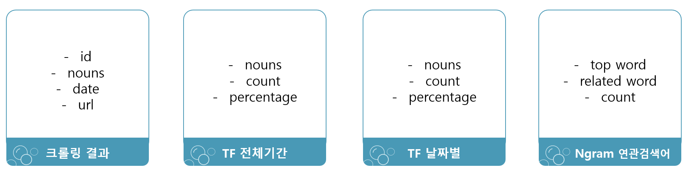

# Text Mining Project   
문서 수집 (crawling) > 형태소 분석 (koNLPy) > 시각화 (web, spring-boot, wordcloud, amcharts)
- Developent enviroment setting

> python 3.x ver study   
> database - elasticsearch, mysql   
> web - spring boot 2.x ver with mybatis, maven, thymeleaf, AM chart   
   
- functions (python 3.x)
> crawiling naver news   
> data preprocessing    
> calculate tf (term frequency)   
> calculate ngram (related search terms)  
   
***
### naver news crawler
this is using Korean   
- BuautifulSoup - bs4 and selenium   
- upload 4 version of crawling code   
> korean window os   
> korean linux os   
> english window os   
> english linux os   

***
### python project
총 10개의 파일  
실제 테스트를 위해서는 ex.py, mysql.py 에서 host, port, user, passwd, db 등 정보 입력해야 함   

|파일|설명|
|------|---|
|[main.py](https://github.com/YEONGYEO/Text-Mining-Project/blob/master/project/main.py)|project 전체 main 함수 실행 시, 모든 코드 실행|
|[crawler.py](https://github.com/YEONGYEO/Text-Mining-Project/blob/master/project/crawler.py)|네이버 뉴스 크롤링 기능|
|[data_preprocessing.py](https://github.com/YEONGYEO/Text-Mining-Project/blob/master/project/data_preprocessing.py)|형태소 분석, 명사 추출, 불용어 처리 등 데이터 정제|
|[es.py](https://github.com/YEONGYEO/Text-Mining-Project/blob/master/project/es.py)|elasticsearch 저장 및 검색|
|[df_export.py](https://github.com/YEONGYEO/Text-Mining-Project/blob/master/project/df_export.py)|dataframe export to csv, excel, txt|
|[mysql.py](https://github.com/YEONGYEO/Text-Mining-Project/blob/master/project/mysql.py)|mysql 저장 및 검색|
|[ngram.py](https://github.com/YEONGYEO/Text-Mining-Project/blob/master/project/ngram.py)|연관검색어 기능 구현|
|[tfidf.py](https://github.com/YEONGYEO/Text-Mining-Project/blob/master/project/tfidf.py)|단어 빈도수 계산, sklearn tfidf 행렬 값 계산|
|[stop.txt](https://github.com/YEONGYEO/Text-Mining-Project/blob/master/project/stop.txt)|불용어 text file|

   
- 전체 과정
      
- MySql database 구조

   

***

